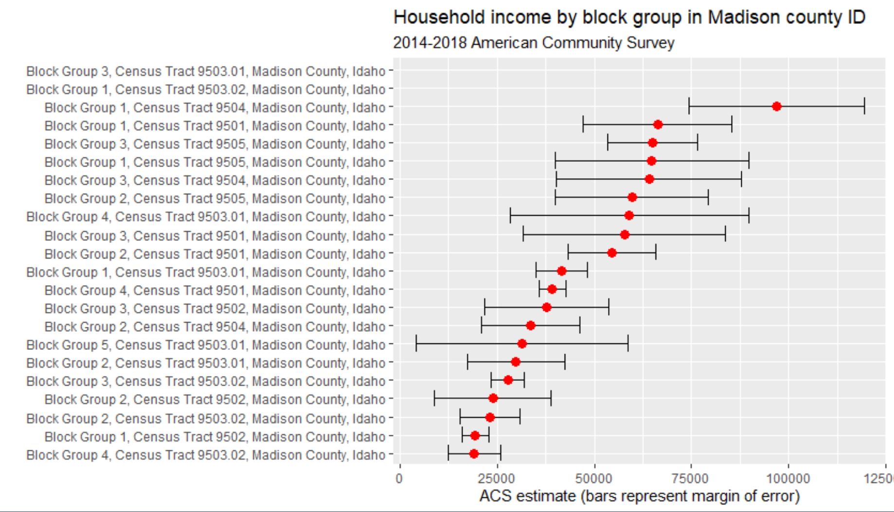
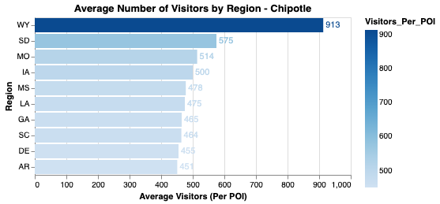

# Statement of Work Proposal

Team Agile - *Winter 2022*

Ben Black -         Computer Science  
Bryce Blignaut -    Data Science  
Justin Schultz -    Data Science  
Spencer Guo -       Data Science  
Toma Lukashova -    Data Science

### Statement of Work

We propose to leverage SafeGraph data, United States Census data, and highway exit location data to generate location and demographic data to predict expansion locations that businesses will likely succeed in. 

### Business Needs

Businesses who's primary business comes through physical storefronts needs to be able to expand if the want to grow. Our predictive model will be able to give them location suggestions of where they would be likely to succeed. This will be of value to a business because it will help lower the risk of new under-performing locations and maximize in-person traffic.

### SafeGraph Data Usage

We will be using the following columns from the SafeGraph Patterns dataset:  
location_name  
lat  
long  
city  
region  
safegraph_brand_ids  
brands  
raw_visit_counts  
raw_visitor_counts  
visits_by_day  
poi_cbg  
visitor_home_cbgs  
visitor_daytime_cbgs  
distance_from_home  
bucketed_dwell_times  
popularity_by_hour  
popularity_by_day  
normalized_visits_by_total_visits  

As our project develops, we may end up using more than just the above mentioned.

The following visualization was produced using United States Census data that we will be leveraging in our project. This shows some of the data and how we want to use it

  
<b>Average income by Census Block in Madison County: 2014-2018</b>  

The following visualization uses SafeGraph data to show the regions with the highest average number of visitors per location. The total number of visitors was divided by the number of locations in each region.

  
<b>Average Number of Chipotle Visitors per Location by Region: December 2021</b>

### Other Data Usage

By connecting to United States Census data, we'll be able to determine average and median demographic statistics for each Census block, which we'll be able to join to the visitor data to be able to tell demographic data for customers and businesses. We'll also use a highway exit dataset to provide additional POI location context.

### Definition of a Successful Project

Our project is defined as successful is someone interacting with our final application can select a business and some place they'd like to expand into, and our application will give a couple options of places the business will likely be successful in. Our model will look at other locations for the business that already exist, and analyze their success and the location and demographic data connected to that location. It will then find locations with similar data and predict if the business will likely be successful there. The top locations will be given to back to the user.